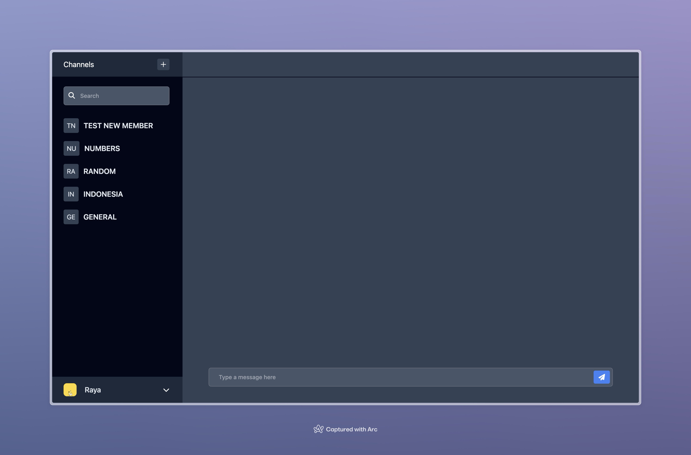
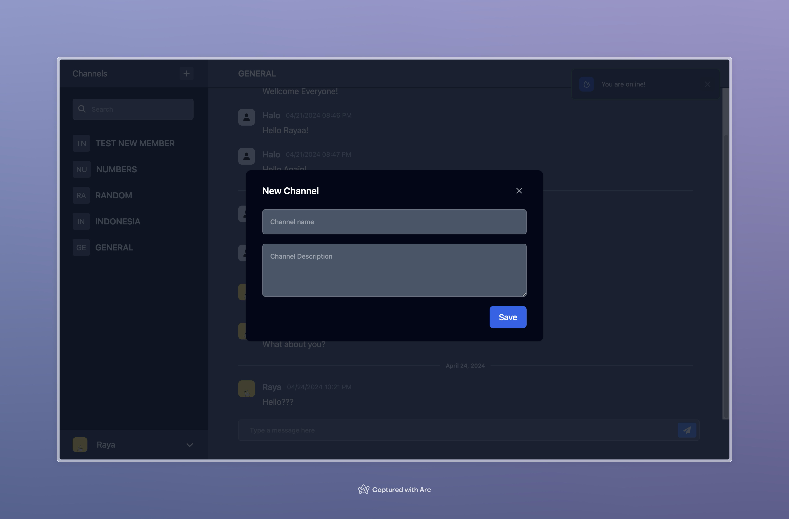
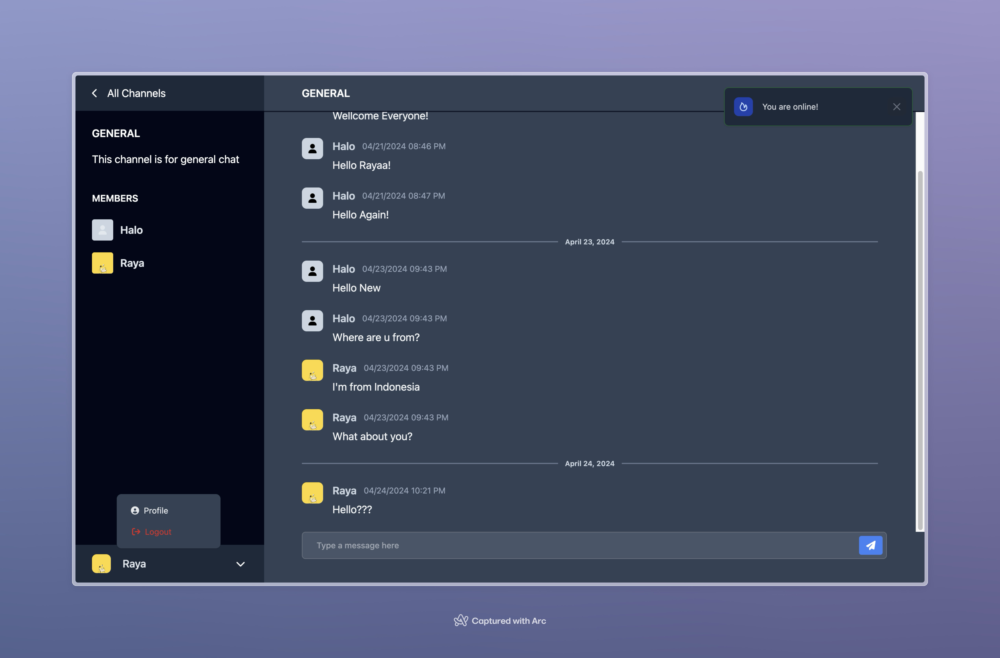
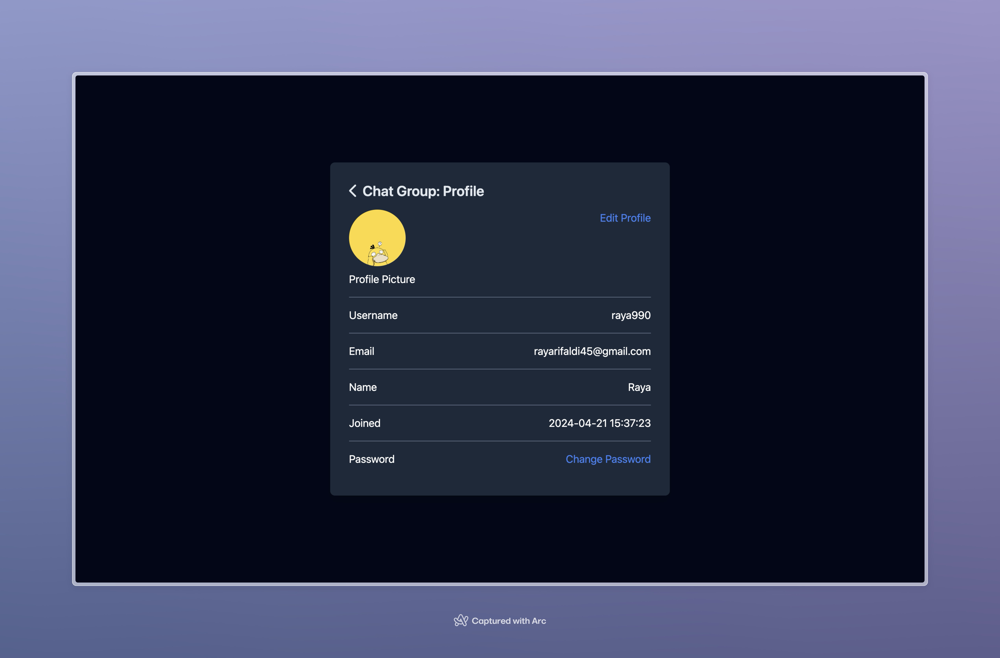
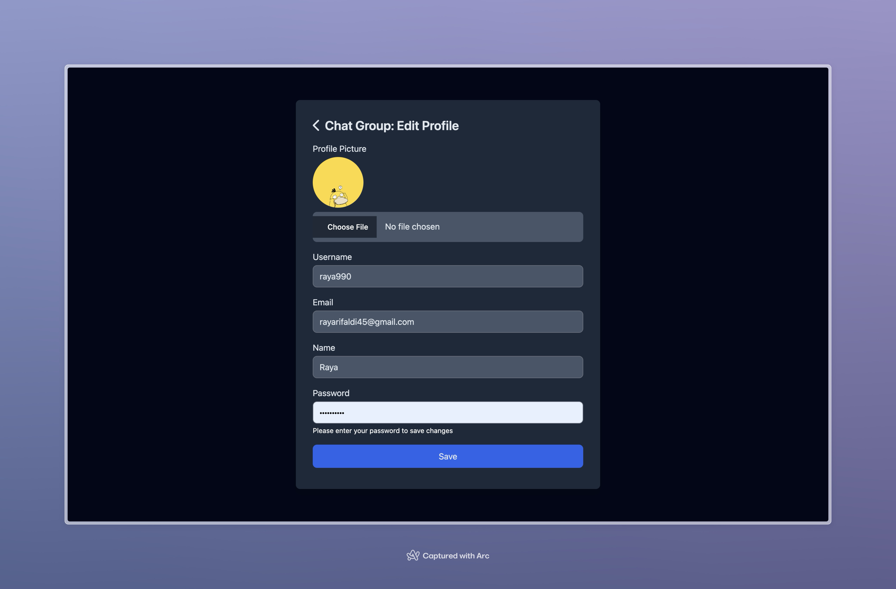

# Chat Group Harvard CS50 Final Project

#### Video Demo: [https://youtu.be/1Q6J9Q6J9Zo](https://youtu.be/1Q6J9Q6J9Zo)

## Description:

Chat Group is a web application that allows users to create channels and chat with other users in real-time. Users can create an account, join channels, and send messages to other users in the channel. Users can also edit their profile, picture, password and see the chat history.

## Feature Details:

1. **User authentication:**
   - Users can create an account and log in.
   - Users can log out.
2. **Create account:**
   - Users can create an account by providing a username, email, name and password.
   - Username and email must be unique.
   - Password must be at least 8 characters long and contain at least combination of letter, number, and special character.
3. **Create channels:**
   - Users can create a new channels when they click the Plus icon in the sidebar.
   - Users can give the channel a name and a description.
   - Users can see the list of all channels created.
4. **Join channels:**
   - When users click on a channel, they will immediately join that channel as a member.
5. **Search channels:**
   - Users can search for channels by name on the search bar.
6. **Channel details:**
   - Users can see the channel name, description, and the number of members in the channel.
   - Users can see the list of all members in the channel.
   - Users can see the chat history.
7. **Send messages:**
   - Users can send messages to a channel, and all connected users will see the message in real-time.
   - When a user sends a message, their username, profile picture, and the time the message was sent will be displayed.
   - When a user refreshes the page, they will see the chat history.
8. **Edit profile:**
   - Users can edit their profile by clicking on the profile icon in the bottom left corner.
   - Users can change their name, email, username, and password.
9. **Edit picture:**
   - When users are on the edit profile page, they can change their profile picture by uploading a new picture.
   - Picture will be uploaded to Cloudinary.
10. **Profile details:**
    - Users can see their profile picture, name, email, username, and the date they joined.

## Technologies:

- Flask
- Python
- Socket.IO
- SQLite
- Cloudinary
- Jinja
- JavaScript
- HTML
- CSS

## Getting Started:

**Requirements:**

- Python 3.6 or higher
- Pip

**Installation:**

1. Clone the repository:
   ```bash
   git clone https://github.com/gitraya/chat-group.git
   ```
2. Change to the project directory:
   ```bash
   cd chat-group
   ```
3. Create a virtual environment:
   ```bash
   python -m venv venv
   source venv/bin/activate
   ```
4. Install the required packages:
   ```bash
   pip install -r requirements.txt
   ```
5. Set the environment variables:

   ```bash
    copy .env.example .env

    # Open the .env file and add your Cloudinary credentials
   ```

6. Create the database:
   ```bash
   sqlite3 chat.db < init.sql
   ```
7. Run the application:
   ```bash
    flask run
   ```
8. Open your web browser and go to `http://127.0.0.1:5000/`

## Acknowledgements:

- [Socket.IO](https://socket.io/)
- [Flask-SocketIO](https://flask-socketio.readthedocs.io/en/latest/)
- [Cloudinary](https://cloudinary.com/)
- [Jinja](https://jinja.palletsprojects.com/en/3.0.x/)

## Screenshots:






